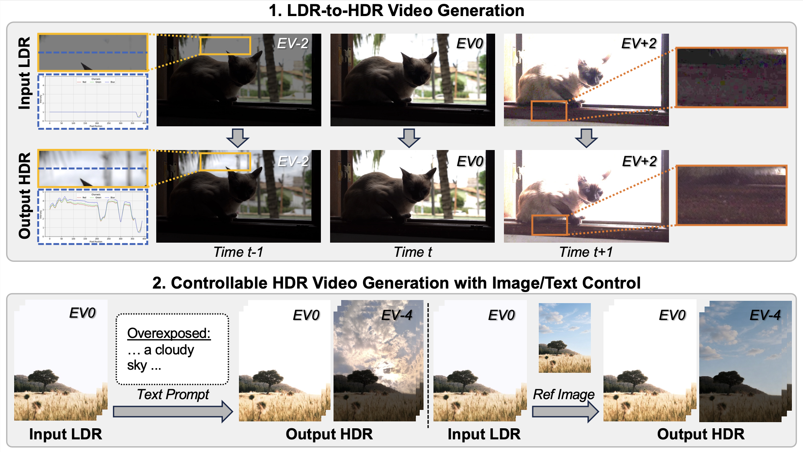

# DiffHDR: Re-Exposing LDR Videos with Video Diffusion Models (ECCV 2026)

[](https://eyeline-labs.github.io/DiffHDR/)
[](https://arxiv.org/abs/2604.06161)
[](https://huggingface.co/ZhengmingYu/DiffHDR)
[](https://youtu.be/kq8qZfwBRs0)

[Zhengming Yu](https://yzmblog.github.io/)<sup>1,2</sup>, [Li Ma](https://limacv.github.io/homepage/)<sup>2</sup>, [Mingming He](https://mingminghe.com/)<sup>2</sup>, [Leo Isikdogan](https://isikdogan.com/)<sup>3</sup>, [Yuancheng Xu](https://yuancheng-xu.github.io/)<sup>2,3</sup>, [Dmitriy Smirnov](https://dsmirnov.com/)<sup>3</sup>, [Pablo Salamanca](https://pablosalaman.ca/)<sup>2,3</sup>, [Dao Mi](#)<sup>3</sup>, [Pablo Delgado](#)<sup>3</sup>, [Ning Yu](https://ningyu1991.github.io/)<sup>2,3</sup>, [Julien Philip](https://julienphilip.com/)<sup>2</sup>, [Xin Li](https://people.tamu.edu/~xinli/)<sup>1</sup>, [Wenping Wang](https://engineering.tamu.edu/cse/profiles/Wang-Wenping.html)<sup>1</sup>, [Paul Debevec](https://www.debevec.org/)<sup>2,3</sup><br/>
<sup>1</sup>Texas A&amp;M University, <sup>2</sup>Eyeline Labs, <sup>3</sup>Netflix<br/>

<p align="center">
  
</p>

## Abstract

> Most digital videos are stored in 8-bit low dynamic range (LDR) formats, where much of the original high dynamic range (HDR) scene radiance is lost due to saturation and quantization. This loss of highlight and shadow detail precludes mapping accurate luminance to HDR displays and limits meaningful re-exposure in post-production workflows. Although techniques have been proposed to convert LDR images to HDR through dynamic range expansion, they struggle to restore realistic detail in over- and underexposed regions. To address this, we present **DiffHDR**, a framework that formulates LDR-to-HDR conversion as a generative radiance inpainting task in the latent space of a video diffusion model. By operating in Log-Gamma color space, DiffHDR leverages spatio-temporal generative priors from a pretrained video diffusion model to synthesize plausible HDR radiance in over- and underexposed regions while recovering the continuous scene radiance. Our framework further enables controllable LDR-to-HDR video conversion guided by text prompts or reference images. To address the scarcity of paired HDR video data, we develop a pipeline that synthesizes high-quality HDR video training data from static HDRI maps. Extensive experiments demonstrate that DiffHDR significantly outperforms state-of-the-art approaches in radiance fidelity and temporal stability, producing realistic HDR videos with considerable latitude for re-exposure.


## Setup

```bash
conda create -n diffhdr python=3.10 -y
conda activate diffhdr

# Install PyTorch (CUDA 11.8)
pip install torch==2.6.0 torchvision==0.21.0 torchaudio==2.6.0 \
    --index-url https://download.pytorch.org/whl/cu118

# Install DiffHDR
cd /path/to/DiffHDR_Code
pip install -e .
pip install -r requirements.txt
```

### Base model

The `hf` CLI used below ships with `huggingface_hub`, which `requirements.txt` already installs.

Download Wan2.1-VACE-14B (~75 GB). This single repo contains everything needed --
the 7 DiT shards, the T5 text encoder, the VAE, and the umt5-xxl tokenizer:

```bash
hf download Wan-AI/Wan2.1-VACE-14B --local-dir models/Wan-AI/Wan2.1-VACE-14B
```

Expected layout:

```
models/Wan-AI/Wan2.1-VACE-14B/
├── diffusion_pytorch_model-0000{1..7}-of-00007.safetensors
├── models_t5_umt5-xxl-enc-bf16.pth
├── Wan2.1_VAE.pth
└── google/umt5-xxl/
```

Set the `MODEL_BASE` environment variable to point the scripts at a different
root instead of `models/`.

### LoRA checkpoints

```bash
mkdir -p models
hf download ZhengmingYu/DiffHDR --local-dir models
```

This fetches both LoRA weights (58 MB each) into `models/`:

| File | Use with |
|------|----------|
| `DiffHDR.safetensors` | `infer_video.py`, `infer_image.py`, `infer_long_video.py` |
| `DiffHDR_Pano.safetensors` | `infer_hdri.py` (360 panoramas) |

### Optional: Flash Attention

Not required -- all inference paths fall back to PyTorch SDPA. Install it only if
you want the speedup, and note that it compiles CUDA kernels from source (needs
`nvcc`, takes tens of minutes):

```bash
pip install psutil ninja packaging wheel   # flash_attn's setup.py needs these
pip install flash_attn --no-build-isolation
```


## Inference

Our paper results were produced with the default `--num_inference_steps 50`. In
practice we found that 10 steps gives comparable quality on many cases, so the
video demo commands below pass `--num_inference_steps 10` to keep them fast.
Drop that flag to reproduce the paper setting.

### Video (MP4 or image folder)

```bash
# From MP4 file
python infer_video.py \
    --lora_path models/DiffHDR.safetensors \
    --input_path demo/room_window.mp4 \
    --output_dir results/video_mp4 \
    --prompt "" \
    --num_inference_steps 10 \
    --add_mask --use_under_exposure_mask --crop_and_resize --srgb_to_lg
```

#### Text-conditioned inference

Provide a descriptive prompt to guide HDR reconstruction:

```bash
python infer_video.py \
    --lora_path models/DiffHDR.safetensors \
    --input_path demo/wooden_house \
    --output_dir results/text_cond \
    --num_inference_steps 10 \
    --prompt "over-exposed: A bright ocean landscape visible through the skylight window, with a wide blue sea stretching to the horizon and soft clouds in the sky. Sunlight shines through the window and softly illuminates the wooden attic interior while keeping the indoor scene unchanged." \
    --seed 33 \
    --add_mask --crop_and_resize --srgb_to_lg
```

#### Image-conditioned inference

Provide a reference image to guide the style and tone of the HDR output:

```bash
python infer_video.py \
    --lora_path models/DiffHDR.safetensors \
    --input_path demo/wooden_house \
    --output_dir results/image_cond \
    --reference_image_path demo/ref_gemini_city.jpg \
    --prompt "" \
    --num_inference_steps 10 \
    --add_mask --crop_and_resize --srgb_to_lg
```

**Key arguments:**
| Argument | Default | Description |
|----------|---------|-------------|
| `--lora_path` | `models/DiffHDR.safetensors` | Path to LoRA weights |
| `--prompt` | `""` | Text prompt for conditioning |
| `--reference_image_path` | None | Reference image for image-conditioned generation |
| `--reference_image_ev` | 5.0 | EV boost applied to reference image before Log conversion |
| `--height` / `--width` | 720 / 1280 | Output resolution |
| `--num_frames` | 33 | Number of frames to generate |
| `--num_inference_steps` | 50 | Diffusion denoising steps |
| `--seed` | 10 | Random seed |
| `--srgb_to_lg` | on | Convert sRGB to Log (`lg`) — log-gamma-encoded linear Rec. 709 |
| `--add_mask` | flag | Compute exposure masks |
| `--use_under_exposure_mask` | flag | Include under-exposure mask |
| `--crop_and_resize` | flag | Center-crop to target aspect ratio |
| `--vace_use_cfa` | flag | Enable Context Focus Attention in VACE encoder |
| `--wan_dit_use_cfa` | flag | Enable Context Focus Attention in DiT |
| `--alpha_init` | 0.0 | CFA initial alpha value |
| `--alpha_over_init` | None | CFA alpha for over-exposed regions |
| `--alpha_under_init` | None | CFA alpha for under-exposed regions |

### Single Image

```bash
python infer_image.py \
    --lora_path models/DiffHDR.safetensors \
    --input_path demo/sample_image.png \
    --output_dir results/image_output \
    --prompt ""
```

### Long Video (sliding window)

For videos with more than 33 frames:

```bash
python infer_long_video.py \
    --lora_path models/DiffHDR.safetensors \
    --input_path demo/long_video_frames \
    --output_dir results/long_video_output \
    --prompt "" \
    --window_size 33 --window_stride 16 \
    --use_prev_window_reference \
    --add_mask --crop_and_resize --srgb_to_lg
```

**How it works:**
- Processes the video in overlapping windows of `window_size` frames
- Stride of `window_stride` frames between windows (overlap = window_size - window_stride)
- Linear temporal blending in overlap regions for smooth transitions
- `--use_prev_window_reference`: passes a reference frame from the previous window for temporal consistency

### HDRI Panorama

For single LDR panorama images (e.g., 360 environment maps):

```bash
python infer_hdri.py \
    --lora_path models/DiffHDR_Pano.safetensors \
    --input_path demo/sample_pano.png \
    --output_dir results/hdri_output
```

This uses overexposure mask detection (luma + channel clipping) and outputs a single HDR EXR panorama at 1024x2048 by default.

## Eval
Evaluate generated HDR EXR frames using `eval/cal_sample.py`:

```bash
# NR metrics only (MUSIQ, CLIPIQA, PU21-PIQE):
python eval/cal_sample.py \
    --gen_dir results/video_mp4 \
    --out_csv results/video_mp4_eval.csv

# With ground truth (adds FovVideoVDP):
python eval/cal_sample.py \
    --gen_dir results/video_mp4 \
    --gt_dir /path/to/gt_exr_frames \
    --out_csv results/video_mp4_eval.csv

# With DOVER video quality metric:
python eval/cal_sample.py \
    --gen_dir results/video_mp4 \
    --out_csv results/video_mp4_eval.csv \
    --dover_repo /path/to/DOVER
```

| Metric | Type | Description |
|--------|------|-------------|
| MUSIQ | NR | No-reference image quality (tonemapped) |
| CLIPIQA | NR | CLIP-based image quality (tonemapped) |
| PU21-PIQE | NR | Perceptual quality on PU21-encoded HDR luminance |
| FovVideoVDP | FR | Full-reference HDR visual difference (JOD) |
| DOVER | NR | No-reference video quality (tonemapped MP4) |
| FID | FR | Distribution distance on tonemapped patches |

For HDR-VDP-3, we follow LEDiff to use the Matlab scripts, please refer the `run_hdrvdp3_dir.m` for the configuration details.


## Training

```bash
# Launch LoRA training
bash scripts/train.sh
```

The training script uses HuggingFace Accelerate for distributed training. Edit `scripts/train.sh` to adjust:
- `--output_path`: where checkpoints are saved
- `--max_train_steps`: total training steps
- `--learning_rate`: learning rate (default 1e-4)
- `--lora_rank`: LoRA rank (default 32)
- `--batch_size`: per-GPU batch size

**Training data format:** EXR frames organized by the metadata CSV, with sRGB LDR and linear HDR pairs.

## Citation

```bibtex
@article{yu2026diffhdr,
  title={DiffHDR: Re-Exposing LDR Videos with Video Diffusion Models},
  author={Yu, Zhengming and Ma, Li and He, Mingming and Isikdogan, Leo and Xu, Yuancheng and Smirnov, Dmitriy and Salamanca, Pablo and Mi, Dao and Delgado, Pablo and Yu, Ning and others},
  journal={arXiv preprint arXiv:2604.06161},
  year={2026}
}
```


## Acknowledgements
Our work is built upon many awesome prior works:

- **[DiffSynth-Studio](https://github.com/modelscope/DiffSynth-Studio)** --
  the `diffsynth/` package in this repository is a reduced, modified fork of it.
- **[Wan2.1-VACE-14B](https://huggingface.co/Wan-AI/Wan2.1-VACE-14B)** --
  the base video diffusion model that our LoRA is trained on top of.
- `demo/sample_image.png` is from the **SI-HDR** dataset, released with
  Hanji et al., *Comparison of single image HDR reconstruction methods -- the caveats
  of quality assessment*, SIGGRAPH 2022
  ([project page](https://www.cl.cam.ac.uk/research/rainbow/projects/sihdr_benchmark/),
  [dataset](https://doi.org/10.17863/CAM.87333)).
  
We thank these authors for their great works and open-source contribution.


## License

This project is released under the licence in [LICENSE](LICENSE).

It bundles third-party code: `diffsynth/` is derived from
[DiffSynth-Studio](https://github.com/modelscope/DiffSynth-Studio), licensed under
Apache-2.0. Files in that directory have been modified from the originals; the
upstream copyright and licence terms continue to apply to them.
